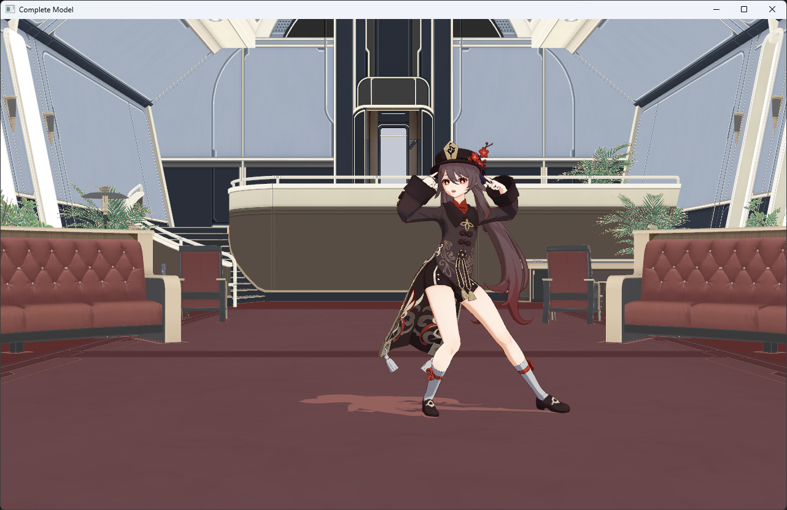

# OpenGL-MMD
Load pmx model and generate demo

- PMXLoader: Utilize Assimp for PMX model loading
- StaticModel: Implement texture-based PMX model rendering
- LightModel: Implement PMX model rendering with integrated lighting effects
- CompleteModel: Implement PMX model rendering with integrated lighting effects, background scenery, and VMD animations

